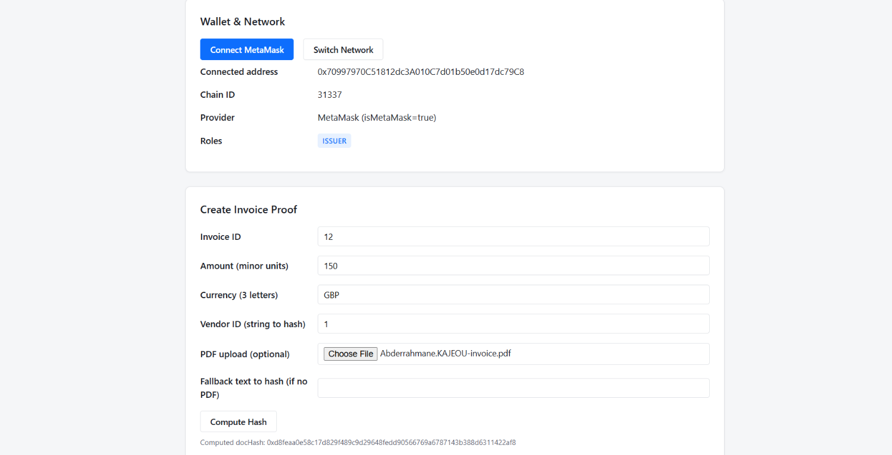
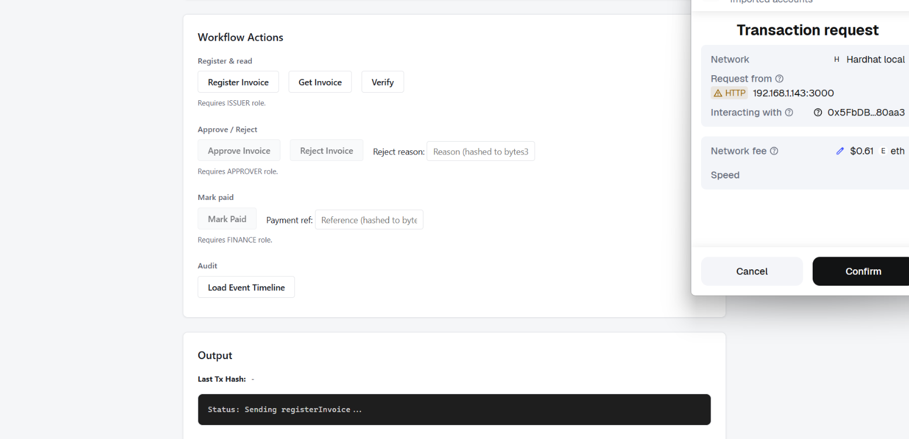
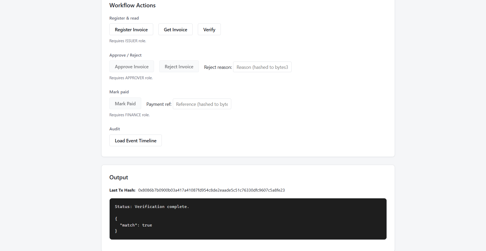
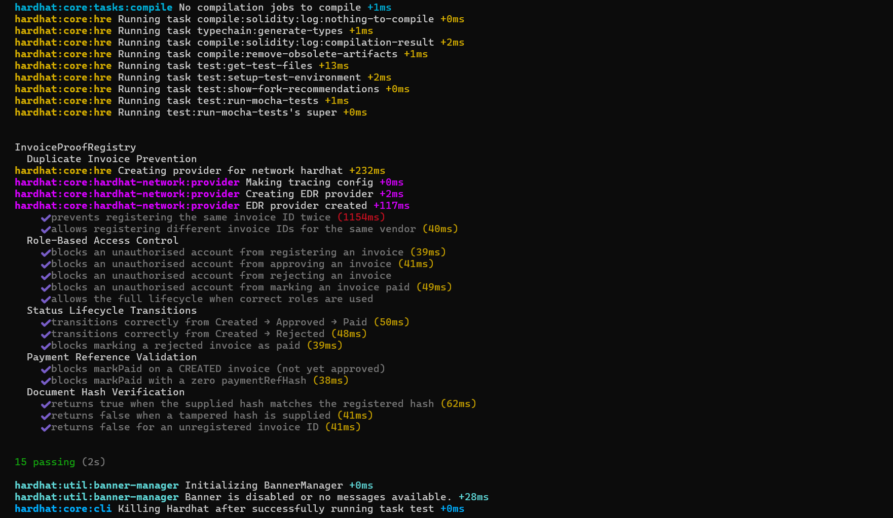

# Invoice Proof Registry 
A local proof-of-concept dApp that anchors invoice document hashes and metadata on a blockchain to reduce tampering, duplicate claims, and missing audit evidence. Invoices progress through a role-based lifecycle (Created → Approved/Rejected → Paid) with on-chain verification and an event timeline.

---

## Problem statement

Organisations face **invoice tampering**, **duplicate payment claims**, and **missing or inconsistent audit evidence**. This project demonstrates storing a **cryptographic proof** (Keccak256 hash) of an invoice document on-chain, together with metadata (amount, currency, vendor, status), so that anyone can **verify** that a given document matches the registered hash and trace the **status lifecycle** via events—without changing core business processes.

---

## Key features

- **Hash proof**: Client-side Keccak256 of PDF or fallback text; only the hash is stored on-chain.
- **Role-based access**: ISSUER (register), APPROVER (approve/reject), FINANCE (mark paid); UI shows role badges and gates actions.
- **Status lifecycle**: Created → Approved or Rejected → Paid; status and timestamps on-chain.
- **Verify**: Check that a document hash matches the registered hash for an invoice ID.
- **Event timeline**: Query and display InvoiceRegistered, InvoiceApproved, InvoiceRejected, InvoicePaid for an invoice (audit trail).
- **Role-gated UI**: Plain HTML/JS frontend with MetaMask; buttons enabled/disabled by connected wallet roles and network.

---

## Architecture

```
  PDF or text
       │
       ▼
  Client (browser): Keccak256(doc) → docHash
       │
       ▼
  MetaMask → Hardhat local chain (31337)
       │
       ▼
  Contract: register(invoiceId, docHash, amount, currency, vendorIdHash)
       │
       ├── Store: docHash + metadata + status
       ├── Emit: InvoiceRegistered, InvoiceApproved, InvoiceRejected, InvoicePaid
       │
       ▼
  Verify: getInvoice(invoiceId) / verify(invoiceId, docHash)
  Timeline: getLogs → parse events → display by block
```

**Pipeline (bullet form):**

- **Off-chain**: PDF/text → client-side Keccak256 → `docHash`.
- **On-chain**: `registerInvoice(invoiceId, docHash, amount, currency, vendorIdHash)` (ISSUER only).
- **Lifecycle**: Approve / Reject (APPROVER), Mark Paid (FINANCE).
- **Verify**: Compare supplied `docHash` with stored hash for `invoiceId`.
- **Audit**: Query contract events by `invoiceKey` → event timeline.

---

## Tech stack

- **Smart contract**: Solidity 0.8.24, OpenZeppelin AccessControl (ISSUER, APPROVER, FINANCE roles).
- **Chain**: Hardhat local node (chainId 31337).
- **Frontend**: Plain HTML, CSS, JavaScript; ethers.js v6; MetaMask; no React/build step.
- **Tooling**: Hardhat (compile, deploy, test), Node.js, `npx serve` for the demo UI.

---

## How it works

- **On-chain**: The contract stores, per invoice ID (hashed to a key), a `docHash`, issuer address, amount, currency (bytes3), vendorIdHash, status (Created/Approved/Rejected/Paid), timestamps, and optional paymentRefHash. Only hashes and metadata are stored; no document content. Roles (ISSUER, APPROVER, FINANCE) are enforced by the contract; the UI reflects them and gates write actions.

- **Off-chain**: The user selects a PDF or enters fallback text in the browser. The app computes Keccak256 in the client and sends only the hash (and metadata) to the contract. Verification is done by recomputing the hash of the document and calling `verify(invoiceId, docHash)`.

---

## Quickstart

1. **Install dependencies**
   ```bash
   npm install
   ```

2. **Start Hardhat local node** (leave running in one terminal)
   ```bash
   npx hardhat node
   ```

3. **Deploy the contract** (in a second terminal, from repo root)
   ```bash
   npx hardhat run scripts/deploy.js --network localhost
   ```
   This compiles the contract, deploys it, grants ISSUER/APPROVER/FINANCE to Hardhat accounts, and writes `frontend-test/contract-info.json` (chainId, contractAddress, ABI). **Do not commit private keys; use only the Hardhat-provided dev accounts for local testing.**

4. **Serve the frontend**
   ```bash
   cd frontend-test && npx serve
   ```
   Open the URL shown (e.g. http://localhost:3000).

5. **MetaMask setup**
   - Add a new network: RPC URL `http://127.0.0.1:8545`, Chain ID `31337`.
   - Optionally name it e.g. "Hardhat Local".
   - Import one or more Hardhat dev accounts (private keys are printed by `npx hardhat node`) to act as ISSUER, APPROVER, or FINANCE.
   - Connect the dApp and use "Switch Network" if needed; the app will prompt to add the chain if missing.

---

## Demo walkthrough

1. **Connect** MetaMask and ensure you’re on Hardhat Local (31337). Role badges (ISSUER, APPROVER, FINANCE) appear based on the connected account.
2. **Register**: As ISSUER, fill Invoice ID, Amount, Currency (3 letters), Vendor ID; compute docHash (PDF or fallback text); click "Register Invoice."
3. **Approve**: As APPROVER, enter the same Invoice ID and click "Approve Invoice" (or "Reject Invoice" with a reason).
4. **Mark paid**: As FINANCE, enter the Invoice ID and a payment reference; click "Mark Paid."
5. **Verify**: Use "Get Invoice" to see stored data; use "Verify" with the same docHash to confirm a document matches the registered hash. Use "Load Event Timeline" to see the audit trail for that invoice.

---

## Security and limitations

- **Local chain**: The Hardhat node is ephemeral; restarting it resets state. This is a **local demo** only.
- **PoC only**: Not audited; not suitable for production. Use only on a local or test network.
- **Hashes**: Storing a document hash proves consistency (same document → same hash) but does **not** by itself provide legal or compliance guarantees; treat as a technical proof-of-concept.
- **Keys**: Never commit `.env` or private keys. Use Hardhat’s default accounts or separate test wallets for local development.

---


## Screenshots

### Wallet & Role Detection
Shows wallet connection, network validation, and role-based access control.  
The connected account is detected and permissions are displayed (e.g., ISSUER).



---

### Invoice Registration Workflow
User signs a transaction via MetaMask to register an invoice proof on-chain.  
The document hash and metadata are recorded immutably.



---

### Verification Output & Audit Trace
The computed document hash is verified against the on-chain record.  
The system confirms integrity and provides a transaction reference.




---
### Test Suite



15 tests passing across 5 suites: duplicate prevention, role-based access control,
status lifecycle transitions, payment reference validation, and document hash verification.

Run with: `npx hardhat test`

---

## Repository structure

```
/contracts          Solidity sources (e.g. InvoiceProofRegistry.sol)
/scripts             Deploy script (writes frontend-test/contract-info.json)
/frontend-test       Plain HTML/CSS/JS dApp and styles
/test                Hardhat tests (Hardhat test suite – 15 tests across 5 suites (run: npx hardhat test))
```

The file `frontend-test/contract-info.json` is **generated by the deploy script**; it is not hardcoded. Run `npx hardhat run scripts/deploy.js --network localhost` after starting the node to (re)generate it.

---

## Contributing

See [CONTRIBUTING.md](CONTRIBUTING.md) for how to run locally, report issues, and coding style.

---

## License

MIT. See [LICENSE](LICENSE).

